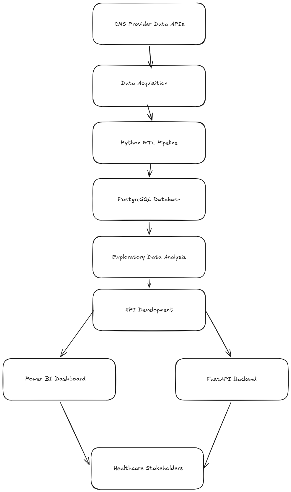

# HealthOps Intelligence

## Hospital Performance Analytics Platform

HealthOps Intelligence is an end-to-end healthcare analytics platform designed to analyze hospital performance, readmission trends, patient experience, and healthcare quality metrics using real-world CMS Provider Data.

The platform combines data engineering, analytics, business intelligence, and API development to transform healthcare data into actionable insights for hospital administrators, analysts, and decision-makers.

---

## Project Objectives

* Analyze hospital performance metrics
* Monitor healthcare quality indicators
* Evaluate hospital readmission trends
* Analyze patient experience and satisfaction
* Build executive-level healthcare dashboards
* Develop automated healthcare data pipelines
* Create scalable healthcare analytics APIs

---

## Data Sources

### CMS Provider Data

#### Dataset 1: Hospital General Information

* Hospital Ratings
* Hospital Ownership
* Hospital Type
* Location Information

#### Dataset 2: Hospital Readmissions Reduction Program

* Excess Readmission Ratio
* Predicted Readmission Rate
* Expected Readmission Rate
* Number of Readmissions

#### Dataset 3: Patient Survey (HCAHPS)

* Patient Satisfaction Ratings
* Survey Response Rates
* Patient Experience Metrics

### Common Join Key

```text
facility_id
```

---

## Tech Stack

### Data Ingestion

* CMS Provider Data APIs
* Python Requests

### Data Storage

* PostgreSQL

### Analytics

* Python
* Pandas
* NumPy
* Plotly
* Jupyter Notebook

### Business Intelligence

* Power BI

### Backend

* FastAPI

### Version Control

* Git
* GitHub

---

## Project Architecture



CMS Provider Data APIs
→ Python ETL Pipeline
→ PostgreSQL
→ Analytics Engine
→ KPI Layer
→ Power BI Dashboards
→ FastAPI Services

---

## Modules

### Module 1: Exploratory Data Analysis (EDA)

Analyze:

* Hospital Ratings
* Hospital Ownership
* Hospital Types
* State-wise Performance
* Healthcare Quality Metrics

### Module 2: Readmission Analytics

Analyze:

* Excess Readmission Ratio
* Predicted vs Expected Readmissions
* State-wise Readmission Performance
* Hospital Type Performance

### Module 3: Patient Experience Analytics

Analyze:

* Patient Satisfaction Ratings
* Survey Response Rates
* Experience vs Hospital Rating
* Experience vs Readmissions

### Module 4: Executive Dashboard

Interactive dashboards for:

* Hospital Performance Overview
* Readmission Analytics
* Patient Experience Analytics
* State-wise Comparisons
* KPI Monitoring

### Module 5: API Services

REST APIs for:

* Hospital Insights
* Readmission Analytics
* Patient Experience Metrics
* KPI Reporting

---

## Repository Structure

```text
healthops-intelligence/

├── data/
│   ├── raw/
│   └── processed/
│
├── notebooks/
├── sql/
├── etl/
├── dashboard/
├── api/
├── docs/
├── tests/
│
├── requirements.txt
└── README.md
```

---

## Current Status

Project Planning & Data Acquisition Phase

### Completed

* Repository Setup
* Project Roadmap
* Architecture Design
* Dataset Identification
* API Research

### Upcoming Milestones

* Dataset Acquisition
* Data Modeling
* ETL Development
* Exploratory Data Analysis
* SQL KPI Development
* Power BI Dashboard Development
* FastAPI Backend Development
* Documentation & Deployment

---

## Author

**Karthikeyan L N R**

B.Tech Computer Science Engineering

Aspiring Data Analyst | SQL | Python | Power BI | Healthcare Analytics
